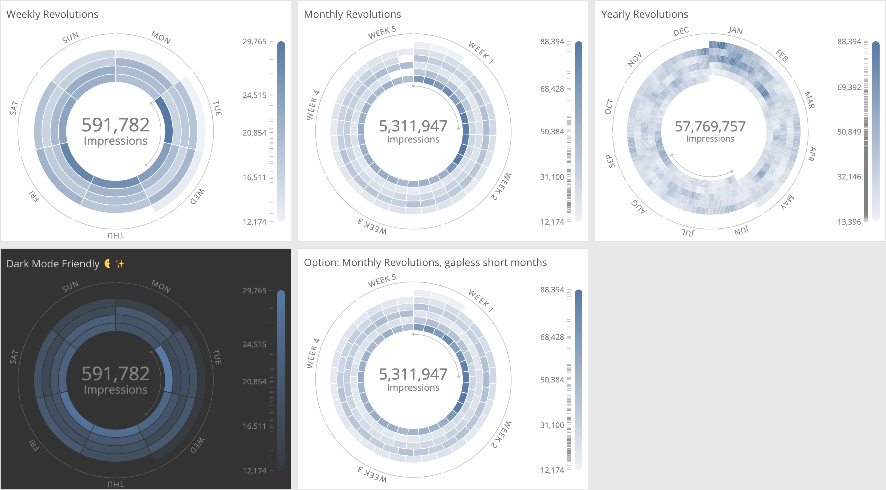

# datorama-d3-radial-heat-map
Custom widget for Datorama. Creates a Radial Heat Map.

Visualise data over very long time ranges with the Radial Heatmap. Your first measurement is visualised, and any extras you add will be shown contextually in the tooltip on hover. It can be configured to revolve once for each week, month, or year.



## Preferences
Add this code to the start of the JS section of the Custom Widget Editor.
```
var revolution = 'month'; // Options: week, month, year

// Week revolution preferences
  var weekdayShift = 1; // 0: Sunday at the top; 1: Monday at the top; etc.

// Month revolution preferences
  var monthsFullRevs = false; // false: day-gaps are left on <31 day months; true: no gaps
  // note: when true, the week number labels won't perfectly match up
```

## Common Style Changes
To change the colour, add this to the start of the CSS section of the Custom Widget Editor.
```
.dataPoint, #legendRect {
  fill: rgb(78, 121, 167);
}
```

## Set up and Dependencies
Add `radialHeatMap.initialize();` to the JS section of the Custom Widget Editor, and add the below links to the dependencies area (second button at the top left of the Custom Widget Editor).

Script dependencies (must be loaded in this order):
1. `https://d3js.org/d3.v5.min.js`
2. `https://dato-custom-widgets-js-css.s3.eu-west-2.amazonaws.com/radial-heat-map/Radial+Heat+Map.js`

Style dependency:
1. `https://dato-custom-widgets-js-css.s3.eu-west-2.amazonaws.com/radial-heat-map/Radial+Heat+Map.css`
